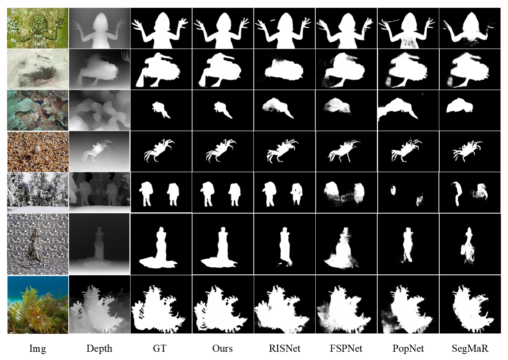
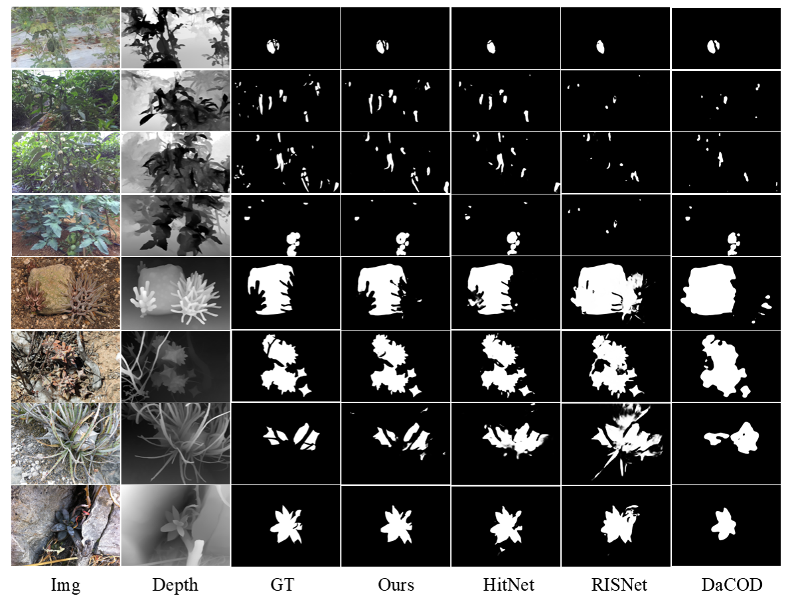

# Breaking Biological Camouflage: DFNet for Unified Detection Across Species Leveraging Depth and Multimodal Fusion

This repository provides the official implementation of our paper.  
The paper is available at: https://doi.org/10.1016/j.asoc.2025.114531

<div align="center">

</div>

<div align="center">

</div>

## Overview
DFNet is an intelligent system designed for the robust detection of both animal (COD) and plant (CCD) camouflage, utilizing monocular depth estimation to enhance geometric understanding and eliminate dependency on specialized sensors.

## Key Features:
- Proposes **DFNet**, an intelligent system for unified cross-species camouflage detection.
- Leverages monocular depth estimation for cost-effective 3D perception without special hardware.
- Introduces adaptive **CUP** and **SMAR** modules to handle morphological variance and occlusion.
- Outperforms state-of-the-art methods in both animal and plant camouflage scenarios.
- Contributes **COD10KM**, a new large-scale benchmark with paired RGB and estimated depth data.


## COD10KM Dataset
The **COD10KM** dataset is a comprehensive collection used for evaluating camouflage detection models. It includes paired RGB and depth images for both animal and human camouflage detection. The dataset consists of 8,394 high-quality samples, covering diverse camouflage environments.

You can access the **COD10KM** dataset here:  
Baidu NetDisk：(<https://pan.baidu.com/s/1tbvG7nDvrOnc8VFBunmQrg?pwd=pp36>)
Google Drive:(<https://drive.google.com/file/d/1iBrnXLhX0x_oCIIiQnF8AUJUGPdMU_aB/view?usp=sharing>)

## Model Segmentation Results Visualization
DFNet's segmentation results can be visualized across different challenging scenarios, demonstrating its ability to distinguish camouflaged objects in complex environments.

You can view the **segmentation results** here:  
Baidu NetDisk:(<https://pan.baidu.com/s/1V3KnYyBxtJOsXNz0qk9ISg?pwd=a669>)
Google Drive:(<https://drive.google.com/file/d/1r-8jvEJBBRSdMkyCqO_7MvKfIFo441__/view?usp=sharing>)

## Model Weights
The pre-trained model weights are provided to allow users to perform inference with DFNet on their own datasets.

You can download the **model weights** here:  
Baidu NetDisk:(<https://pan.baidu.com/s/1KDSUnpemps5KF8mUPQXdJA?pwd=6ccw>)
Google Drive:(<https://drive.google.com/drive/folders/1-sfTvFcx8gpQBU-U8CEjTtLXfbLeXrud?usp=sharing>)

## PVT Weights
For improved performance, the **PVT weights** are available as part of the pre-trained model. These weights are optimized for segmentation tasks in both ecological and agricultural contexts.

You can download the **PVT weights** here:  
Baidu NetDisk:(<https://pan.baidu.com/s/12UPKh0EXqRPiPkJUYx-JUA?pwd=a6dd>)
Google Drive:(<https://drive.google.com/file/d/1Bd6_14qADw15wcYwJJHm4Yz1yfP6J-Xs/view?usp=sharing>)

## Installation and Requirements
### Clone the repository:
   ```bash
   git clone https://github.com/hzzzz71/DFNet.git
   cd DFNet
   ```

### Install dependencies:
pip install -r requirements.txt

### Download the model weights and dataset from the links provided above.

### Training
```python
   python Train.py --epoch 100 --lr 1e-4 --batchsize 4 --trainsize 704 --train_path Your_dataset_path --save_path Your_save_path
```

### Testing
```python
   python Test.py --testsize 704 --pth_path Your_checkpoint_path --test_path Your_dataset_path
```

Acknowledgments
This research was supported by the School of Artificial Intelligence, Xiamen Institute of Technology. We also acknowledge the contributions of various public datasets, including COD10K, CAMO, NC4K, ACD, ACOD-12K, and PlantCamo1250.**

